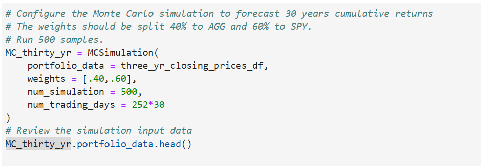

# Financial-Planning
I have decided to start a fintech consulting firm that focuses on projects to benefit local communities. You just won my first contract with a large credit union. The project entails building a tool to help credit union members evaluate their financial health. Specifically, the credit union board wants the members to be able to do two things. First, they should be able to assess their monthly budgets. Second, they should be able to forecast a reasonably effective retirement plan based on their current holdings of cryptocurrencies, stocks, and bonds. The chief technology officer (CTO) of the credit union requested that I develop a prototype application to present at its next assembly.

## Technologies
###### Resource 
- Data Availabe for download:
    -Alpaca
        -Must sign up in order to get API clearance via API key and Secret Key
    
###### Tools
Free Crypto API
Alpaca API
Monte Carlo Simulation
Jupyter Lab
- Jupyter Notebook
- Pythons and Pandas Libraries
- Dotenv
- Json
- OS
- Requests

    

---

## Installation Guide

Installation requirements for this project include:
- import os
- import requests
- import json
- import pandas as pd
- from dotenv import load_dotenv
- import alpaca_trade_api as tradeapi
- from MCForecastTools import MCSimulation
- %matplotlib inline

---

## Results

Make API calls:

Create .env file with API Keys

Alpaca API

Savings Goal Calculation:

Monte Carlo Simulation:

10 year Simulations:

Final Analysis: 
I reviewed a current members portfolio holdings in which they were invested in crypto, stock and bond. We reviewed the portion in order to determine whether or not increasing stocks would have enough of an impact in order for the member to retire earlier
